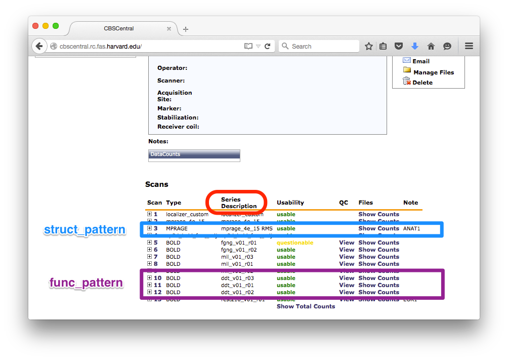

Tutorial for a standard fMRI SPM Pipeline
==========================================

The following instructions will help you access images and logfiles from our
tutorial data, and configure and run our basic fMRI processing and modelling.

1. Choose directories and paths in **project.py** with ``fitz setup``.

2. Specify experiment processing parameters in **{experiment_name}.py**.

3. Download the requested workflow(s) with ``fitz install``

4. Specify which subjects to run with **subjects.txt**

5. Download and prepare images. (``fitz run -w xnatrecon`` or (Harvard CBS) with
   ``ArcGet.py`` and ``dcmstack``)

6. Add preproc and common model options to **{experiment_name}.py**

7. Copy logfiles and create design file

8. Create model file **{experiment_name}-{model_name}.csv**

9. Run workflows:  ``fitz run -w preproc onset model``

.. note:: In this tutorial, files to create are **bold**, important directories
          are *italicized*, and commands to run are ``in monospace`` or large
          code blocks.

Setup Directories and **project.py**
-------------------------------------

There are 3 important directories in a standard project:

fitz dir
  Configuration files and some scripts.

data dir
  Raw data and logfiles.

analysis dir
  Outputs of the workflows and processed data.

To begin, create a directory for your project/study, and a config directory
inside it called "fitz"; this will hold configuration and any scripts you want
to write. You can create both of these at once by typing
``mkdir -p <study>/fitz``. Finally, cd into it run ``fitz setup`` to answer
some questions about where you want your studie's processing directories to
live. Open a Terminal and type:

.. code-block:: bash

    mkdir -p spmFMRI_tutorial/fitz
    cd spmFMRI_tutorial/fitz
    fitz setup

The script will ask questions to help you get started; enter the project name
and experiment name, and type enter for the other options to accept the
defaults::

    Let's set up your project.

    Please enter values for the following settings (just press Enter to
    accept a default value, if one is given in brackets).

    Please use relative paths.

    > Project name: FitzTutorial
    > Default experiment: DD
    > Data tree path [../data]:
    > Analysis tree path [../analysis]:
    > Working tree path [../analysis/workingdir]:
    > Crashdump path [../analysis/niypype-kastman-crashes]:
    > Remove working directory after execution? (Y/n) [y]:

Finally, set an environment variable to tell fitz where to look for
project.py, <study>.py, etc... This will let you run ``fitz`` from any directory
and it will be able to find all the setup without you telling it::

    export FITZ_DIR=<path/to/study/fitz>

.. note:: From here on out, the tutorial assumes you are running commands from
          the FITZ_DIR.

Setup Experiment File **{experiment_name}.py**
------------------------------------------------

Experiments are configured by creating a file called ``{experiment_name}.py``.
This is just a regular python file that defines options and variables used
by the workflows.

In this tutorial we will be processing a simple Delay Discounting experiment,
so our Experiment Name will be DD. Use a text editor to create and edit the
file **DD.py**.

.. code-block:: bash

    # On linux, this might look like:
    gedit DD.py  # linux

    # Or on a mac
    open -a TextEdit DD.py  # Mac

The first thing to do is to specify which pipeline (group of workflows) we want
to use for this experiment. For this tutorial we're going to use a standard
SPM Pipeline found `here
<https://github.com/kastman/fitz_nwlabs_spm_pipeline>`_), which consists of four
workflows: xnatconvert, preproc, onset, and model. We'll get to each of those
workflows below, but first add the name, source URL and version for the pipeline
into the experiment file:

.. code-block:: python

    # Workflow Parameters
    # --------------------
    workflow = "fitz_nwlabs_spm_pipeline"
    workflow_src = "https://github.com/kastman/fitz_nwlabs_spm_pipeline.git"
    workflow_version = "0.0.1.dev"

Install Workflows
------------------

You should now download the pipeline requested by the experiment file. This
goes out to the internet (a repository on github in this case) and grabs the
exact version of the workflow specified in {experiment}.py and copies it into
the fitz directory. You only have to do this once at the start of your
experiment (or any time that the pipeline changes, which should ideally be
never).

.. code-block:: bash

    fitz install

In theory you could wait until just before running your experiment to download
the pipeline, but downloading it now allows you to see the default options and
parameters that will be used for all of your workflows (how? ref) so it's best
to do it now.

Setup **subjects.txt**
-----------------------

A subjects.txt file in the fitz directory is used to list all the subjects
that should be included. For this tutorial we'll only process a single subject,
so create a text file with one line::

    FITZ1

By default ``fitz run`` will perform the processing on all subjects in the
subjects.txt file, but there are several subject-related options. You can use
``--subjects FITZ1`` to specify which subjects to run (in case you need to
re-run just a few after making fixes, and you can also create other group files
called **subjects-{group_name}.txt** that can be run with the ``fitz run
--group group_name`` option.  You can see all the options for ``fitz run``
:ref:`here <commandline>`.

Prepare images in the *data* directory
--------------------------------------------

For this tutorial, you will download dicom data from the CBS Central `xnat`_
server.  We're going to use one real subject from the RSA study as an
example.

Downloading from XNAT and converting images into nifti files in a single step
is the first workflow in the NWLabs SPM Pipeline, but you don't need to use
it - as long as you get nifti images into the data directory, you can use the
other pipelines (preproc, onset, model) without an xnat server.

Image download and conversion to nifti is a special type of workflow - the
output files are put into *data*/{subject_id}/images directory instead of
*analysis*, because the converted niftis are really more like inputs that
processing steps.

To configure the xnatconvert workflow to know which server to connect to,
add the following lines to the experiment file DD.py::

    # Xnat Download and Convert
    # --------------------------
    xnat_project = 'FitzTutorial'
    series_descriptions = ['mprage*RMS', 'dd*']
    server_alias = 'cbscentral'

If you're working on your own study, you'll need to change and specify these
so that the patterns match up. The xnat_project is found on the main project
page next to "ID:".

.. image:: _static/images/XnatProject.png

The list of patterns search the "Series Description" of each image to
find datasets to download; any scan series that match any of the patterns in
the list will be downloaded. In the example above, the first pattern matches the
scan with a description of "mprage_3e_15 RMS" (this is the root mean square
anatomical T1) and the second pattern matches BOLD runs with "ddt" (the Delay
Discounting Task) in their description.

You also need to list which xnat server you want to connect to. For everything
in NWLabs, this will be 'cbscentral' - this should already be set up using
the xnat_auth tool to create a small file to hold your server username and
password using either the xnatconvert workflow or ArcGet.py (below). For more
info on how to set this up if it's not already, see `xnat_auth info`_.

You can now run the fitz workflow to download data::

    fitz run -w xnatconvert

.. note:: If you get a "No Images were downloaded" error you probably set up
   either the project's ID or the patterns incorrectly.

.. note:: If you get an authentication error, you need to setup your login info.
   See `xnat_auth info`_ for instructions.

Aside: CBSCentral NRG Tools
~~~~~~~~~~~~~~~~~~~~~~~~~~~~

If you just want to quickly grab data and are using the Harvard
`Neuroinformatics Research Group`_ (NRG) xnat instances *CBSCentral* or
*GSPCentral*, you can use ArcGet.py to download it and dicomstack to convert it
to nifti format. This does the same thing as the fitz xnatconvert workflow, but
is (for better or worse) a little more flexible.

.. code-block:: bash

    # Change to the data directory
    cd ../data

    # Use ArcGet.py to download T1 & BOLD dicoms from CBS Central
    ArcGet.py -a cbscentral -s FITZ1 -r MPRAGE,BOLD

    # Create a folder for the .nii images
    mkdir ../data/FITZ1/images

    # Use dcmstack to convert images from DICOM to Nifti format
    dcmstack --embed-meta --dest-dir ../data/FITZ1/images --output-ext .nii ../data/FITZ1/RAW

    # don't forget to change back to the fitz directory when you're done
    cd ../fitz

.. note:: ArcGet.py is currently setup & available only on ncfnx / ncf
          workstations, not the Buckerville MacPro or laptops.

Setup Workflow Preprocessing Options
-------------------------------------

Next, configure parameters for the preprocessing workflow and add it to
**<experiment_name>.py**. These options are specific to your study and you'll
have to know a little about your images to set them correctly once you're done
following the tutorial.

To begin, add these config variables to the **DD.py** experiment file to tell
fitz how to find your functional and structural images:

.. code-block:: python

    # Preproc Parameters
    # -------------------
    func_template = "{subject_id}/images/*dd*"
    anat_template = "{subject_id}/images/*mprage*"

Functional images usually have "BOLD", "EPI", or the task name in their series
description (and therefore in their nii filename). Structural / Anatomical
images typically have either "T1", "MPRAGE" or "MEMPRAGE" depending on the
specific sequence that was used.

Moving on, let's next add information about our runs to **DD.py**:

.. code-block:: python

    # Image Params
    n_runs = 3  # Expected number of runs
    TR = 2.5  # Repetition Time (sec)
    interleaved = True  # Order of slice acquisition, false for sequential acquisition
    slice_order = 'up'  # Direction of slice acquisition
    num_slices = 33  # Number of slices

## TODO Add sanity check that ensures these are true
## TODO Add motion_correct = True
## TODO Print default options

Image parameters are available in the scan parameter pdf created when you first
set up your study, and also in the header information of dicom files and nifti
images created with the ``dcmstack --embed-meta`` flag (the xnatconvert workflow
does this).

To figure out what these paramters were for our images, we can check the
relevant header info. Run the following in Terminal to look at the values for
the first task image:

.. code-block:: bash

  img=../data/FITZ1/images/010-ddt_v01_r03.nii

  nitool lookup RepetitionTime $img  # TR
  >  2500.0

  nitool lookup CsaImage.NumberOfImagesInMosaic $img  # num_slices
  >  33

  nitool lookup CsaImage.MosaicRefAcqTimes -i 0,0,0,0 $img  # interleaved & slice_order
  >  [0.0, 1292.50000001, 77.49999998, 1370.0, ... 2435.0, 1217.5]

Note that RepetitionTime is in milliseconds, so convert it to seconds in the
experiment file.

The "Mosaic" in these header keys refers to the way that multiple 2D slices are
saved in a single dicom file - they're stored as one big 2D image and sliced up
when they are converted to nifti. When you see "Mosaic" you can just think of a
single volume.

The Mosaic Acquisition Times tell you that A) the slice order was interleaved
(the times are not sequential) and that the order was increasing - slice 0 is
also time 0 (the start of the TR), instead of time 2435 (the end of the TR).
(The ``-i 0,0,0,0`` simply asks for the reference times of the first,
representative volume).

One additional caveat when using the Parameter pdf sheet instead of pulling
directly from the images is that the *Multi-slice mode* of option is **always**
set to "Interleaved", even when slices are acquired sequentially. The correct
value to look at is the *Series* value directly below it, which will either be
"interleaved", "ascending" or "descending". Additional slicetiming info is at
`Harvard CBS FAQ slice info`_.

For more info on viewing the metadata in a nifti header, see ``nitool dump -h``,
``nitool -h``, or `looking up dicomstack metadata`_. Also note that the
*CsaImage* headers are Siemans specific and may not generalize to other scanner
manufacturers.

.. warning:: Setting image parameter information incorrectly will perform the
             preprocessing invalidly! Take the time to **double check these
             values**, even if you think you know them.

A future version may be able to infer some of these from the dicom header
automatically, but that's not released yet, and you should know how to look
image info up anyway.

Moving on, let's add more info about processing options to **DD.py**:

.. code-block:: python

    # Processing Params
    temporal_interp = True  # Perform slicetiming (temporal interpolation)?
    smooth_fwhm = 6  # Size of smoothing kernel (mm)
    hpcutoff = 120  # Highpass Filter cutoff (sec)
    frames_to_toss = 0  # Frames / volumes to remove from start of each run

The processing parameters listed are standard options: perform slicetiming,
smooth with a 6mm FWHM kernel, use a high-pass filter of 120s and don't
toss any discdacq (discarded acquisition) volumes. For more information on
available options, you can see the :doc:`documentation for the standard fMRI
SPM pipe`.

Finally, set some default options for modeling, still in **DD.py**:

.. code-block:: python

    # Default Model Parameters
    # -------------------------

    bases = {'hrf': {'derivs': [0, 0]}}  # Options for model basis functions
    estimation_method = 'Classical'
    input_units = output_units = 'secs'

In this case we will use SPM defaults for the hemodynamic response functions
('hrf') in our general linear model, and will specify the unit for our design
files will be in seconds (as opposed to TRs).

Copy logfiles and create the Design File
-----------------------------------------

Copy Logfiles from study into your tutorial folder
~~~~~~~~~~~~~~~~~~~~~~~~~~~~~~~~~~~~~~~~~~~~~~~~~~~

For this tutorial, we will grab the original behavioral logfiles from their
current location on the cluster. Unfortunately logfiles are not downloaded from
CBSCentral automatically, and are copied / moved around separately from the
images.

In your own study you will be responsible for copying logfiles to the server
into your own StudyName/Subject_Data/Behavioral directory.

.. code-block:: bash

  # Make folders for the logfiles and design files
  mkdir ../data/FITZ1/logfiles ../data/FITZ1/design

  # Copy the logfiles for the tutorial subject to the data directory
  cp /ncf/jwb/resources/fitz_tutorial/logfiles/* ../data/FITZ1/logfiles/

Design File Information
~~~~~~~~~~~~~~~~~~~~~~~~

There are two easy ways to specify the timing of fMRI information. One is to
create one large design file containing multiple columns for onsets, multiple
columns for durations, and specify which columns to use in your model files
(Method 1). The other is to create a separate csv for each model you want to run
with columns named exactly 'run', 'onset', and 'condition' (Method 2).

By default the design files live in a directory called "design" inside each
subject's data folder, i.e.
``<data_dir>/<subject_id>/design/<design_name>.csv``.
Each row in this file corresponds to an event, where the term “event” is used
broadly and can mean a “block” in a block design experiment.

For either method, the design file should contain a 'run' column, and there
should be only one design file for the whole task (i.e. not 'Model1_run1',
'Model1_run2'). Each row of the design file should be a trial, and there
should be columns for each trial that list the trial type (condition) and trial
time (onset). Additionally, there can be columns for trial duration (this
defaults to zero), and additional values to use for parametric modulators
(e.g. which option a participant chose, the value of their choice).

Regardless of the method you choose, make sure that your logfiles sort
correctly when you list them with ``ls``, because the run column will be added
based on the filenames' alphabetical order.

Method 1: Single Large Design File for all Models
~~~~~~~~~~~~~~~~~~~~~~~~~~~~~~~~~~~~~~~~~~~~~~~~~~

If you plan to use the single large design file method of specifying onsets,
you can combine them with the design file helper ``log2design.py`` that comes
with fitz. The following will combine the logfiles and add a 'run' column,
while leaving in other columns that can be referenced from model files. On a
side note, if your log files contain all the information required (including
run), you can also just concatenate each of your existing csvs together with
``cat``:

.. code-block:: bash

  log2design.py ../data/FITZ1/logfiles/*.csv --out ../data/FITZ1/design/DD-Combined.csv

  # Or, if your logfiles already contain a "run" column...
  cat ../data/FITZ1/logfiles/*.csv > ../data/FITZ1/design/DD-Combined.csv

.. note:: Don't forget to remove the header rows from the bottom two runs if
          you use ``cat``.

Method 2: Separate, model-specific design files
~~~~~~~~~~~~~~~~~~~~~~~~~~~~~~~~~~~~~~~~~~~~~~~~~~~~~~~~~~~~~~~~~~~

Some people prefer to have separate design files for each model - this is the
Lyman style and allows for exact model compatibility, and also lets you see
exactly what the onsets will look like. For the model below in this tutorial
we will use Method 1, but feel free to experiment.

For simple designs where most of what you want already exists in your logfiles,
fitz includes a simple script called ``log2design.py`` that will select
and stack logfile into a "long" style csv with appropriate columns.

*If your logfiles don't have appropriate columns already, you won't be able to
use the script helper and will have to make your own design files, or create new
logfiles that include these columns.*

An extremely simple design file in the style of separate design files would
look like::

    run, condition, onset
    1, sooner, 0
    1, sooner, 12
    2, sooner, 0
    2, later, 12

For this DD task, we could map the following columns from the logfiles and
create a model file in *data*/{subject_id}/design/**DD-1.1.Choice.csv**:

.. cssclass:: table-striped

  +---------------------+--------------------+
  | logfile column name | design column name |
  +=====================+====================+
  | choice              | condition          |
  +---------------------+--------------------+
  | cuesTime            | onset              |
  +---------------------+--------------------+
  | trialResp.rt        | duration           |
  +---------------------+--------------------+
  | choiceInt           | pmod-ChoiceInt     |
  +---------------------+--------------------+

.. code-block:: bash

  # Create a design file for Model1 using the log2design.py script (or do it yourself)
  log2design.py ../data/FITZ1/logfiles/*.csv --out ../data/FITZ1/design/DD-Model1.csv --condition-col choice --onset-col cuesTime --duration-col trialResp.rt --pmods-col choiceInt

Models may be as complicated (or simple) as you want, and you should feel free
to create the csv yourself without the help of ``log2design.py`` in the case
of more complicated modeling, etc.

Waskom's `Lyman Documentation`_ also has more info on the design file and
additional regressors file where post-convolved regressors for each TR may also
be added to the model.

.. note:: Note that the 'pmod-' columns correspond *roughly* to 'value' columns
          in a standard lyman design file, but are not the same thing. See
          `Mumford, Poline and Poldrack 2015`_ for a discussion on how
          parametric regressors and orthogonalization are handled between
          different fMRI packages. (TL;DR, Fitz enters these columns as pmods in
          SPM, while Lyman enters values as amplitudes.)

Model Options (Design File and Contrasts)
------------------------------------------

Information about specific models are listed in their own python files
**<experiment_name>-<model_name>.py**. If you want a specific order of models
(for example you're creating models at different onset times) you should
list your model numbers explicitly in the model name. *Model Names are used
in directories, so don't include spaces or special characters*.

Paste the following lines into a new file called DD-1_1_Choice.py to specify a
new model. For this tutorial we are specifying a model pulled from a large
design file (method 1), where condition and onset columns are listed by the
model instead of being named in the csv directly, so we specify which columns
are used for the onset time, duration, etc.

The column names (e.g. 'sooner', 'later') must be values in the conditions
column; if no conditions are listed the model will use all of the values found
in the condition_col. Note that this method precludes modeling different parts
of a trial (cue presentation and response) within the same model; although those
regressors are likely to be highly correlated and aren't recommended to be
modeled together anyway unless they are significantly jittered. If that's the
case you should construct the design file with each part of the trial listed
in a different row and different conditions / trial types; a long "Method 2"
design file is recommended in that case.

If "duration-col" is set to an integer instead of a string (i.e. 0 or 4) that
value will be used for all events.

Additionally, we are also creating two contrasts - one for the main effect of
all trials and one for the parametric modulator. The format of a contrast is
a tuple of three values: the contrast name, contrast columns, and contrast
weights for each of those columns.

.. code-block:: python

  design_name = 'DD-Combined'

  conditions = ['sooner', 'later']
  condition_col = 'choiceStr'
  onset_col = 'cuesTime'
  duration_col = 'trialResp.rt'
  # pmod_cols = ['choiceInt']

  contrasts = [
    ('all trials', ['sooner', 'later'], [1, 1]),  # 1
    ('sooner vs later', ['sooner', 'later'], [1, -1]),  # 2
    ('later vs sooner', ['sooner', 'later'], [-1, 1]),  # 3
    # ('choice',     ['soonerxchoice^1', 'laterxchoice^1'], [1, 1])  # 4
  ]

Run Workflows
--------------

Preproc
  Performs slicetime correction, realignment, coregistration, normalization
  and smoothing.

Onsets
  SPM requires binary .mat files in a specific format. This workflow converts
  the design file and design options from your model into properly formatted
  SPM .mat multiple conditions files.

Model
  Calculates artifacts, specifies a model design and estimates the model
  and contrasts.

.. code-block:: bash

    fitz run -w preproc onset model --model 1_1_Choice

.. note:: N.B. There is no default model, so you must specify which one you
   want to use with the ``--model`` flag.

References
-----------

For more information and to see all the parameters that can be set for each
workflow, see the :doc:`documentation for the standard fMRI SPM pipe`.

The `Lyman Documentation`_ contains more information on additional regressors
and a few things that apply to fitz but haven't been discussed here.

.. _Lyman Documentation : http://stanford.edu/~mwaskom/software/lyman/experiments.html#the-design-file
.. _xnat : http://www.xnat.org
.. _Harvard CBS FAQ slice info : http://cbs.fas.harvard.edu/science/core-facilities/neuroimaging/information-investigators/scannerfaq#slice_order
.. _Mumford, Poline and Poldrack 2015 : http://journals.plos.org/plosone/article?id=10.1371/journal.pone.0126255
.. _Neuroinformatics Research Group : http://neuroinfo.org
.. _xnat_auth info : http://people.fas.harvard.edu/~kastman/nwlabs_pipeline/xnat_auth.html
.. _looking up dicomstack metadata : http://dcmstack.readthedocs.org/en/latest/CLI_Tutorial.html#looking-up-meta-data
